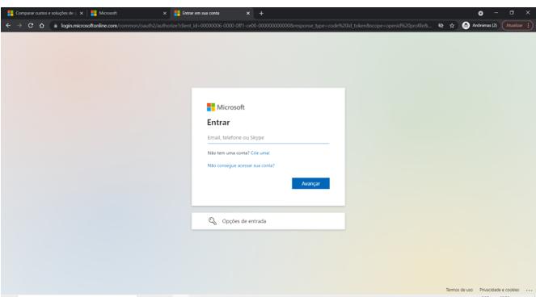

## Baixar MS project

Passo a passo para utilizar 1 mês grátis do Microsoft Project.
 
OBS.: O MS Project não funciona no Mac, mas apenas no Windows. Caso você utilize o Mac, uma alternativa (imitação) que recomendo experimentar, muito semelhante ao MS Project, é o Open project.

1º Passo: Entre nesse site e escolha a opção destacada em vermelho.

 

 
Atenção: nós utilizaremos no curso a versão cliente do MS Project e não a versão WEB. Ou seja, você irá instalar o MS Project em seu computador.

2º Passo: será solicitado para você preencher os seus dados, tais como e-mail, telefone e outros, mas nada diferente do que qualquer outro site pede.
 
Pedirá também dados básicos da sua empresa. Se você não possui empresa, existem sites que geram CNPJs válidos automaticamente. Basta digitar "gerador cnpj válido" no google.
 
Os dados são apenas para um cadastro mais completo. A Microsoft tem exigido cada vez mais nestes cadastros.

 
 
Porém, o seu número de telefone precisa ser real, pois o site enviará um SMS com um código de verificação.
 
3° Passo: preencha o nome da sua empresa (ou outra que utilizar) no campo de domínio. Não utilizaremos este recurso em nosso curso, porém, é de preenchimento obrigatório.

 

 4° Passo: defina seu login e senha. Anote eles em um arquivo de texto, pois você precisará deles para acessar o MS Project, após baixa-lo e instala-lo.

 
 
5° passo: preencha seu endereço.

6° Passo: você receberá um email de confirmação de cadastro. Clique no botão “Iniciar a avaliação”.
 

7° Passo: digite o login e senha que você criou durante o cadastro.
 
 
 
Pronto. Você poderá agora baixar a instalar o Microsoft Project.
Para instalar o Setup, basta ir pressionando em “Avançar”, como a instalação de qualquer outro software.
 

