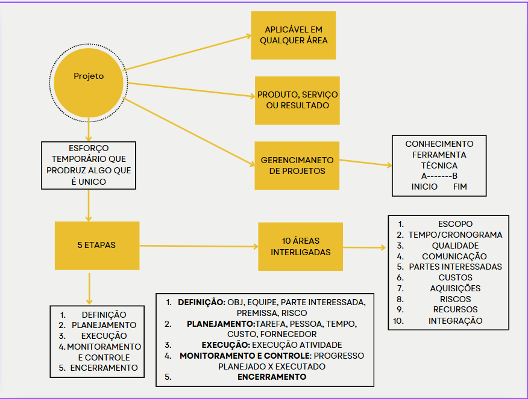

## Projeto

* Esforço temporário que produz algo único
* Pode ser produto,serviço ou resultado.

Projeto--> 5 fases--> 10 areas --> 3 intimamente relacionadas--> 3 secundárias

Fases do projeto:

1. Definição
    * Objetivo, equipe, parte interessada, premissa,risco
2. Planejamento
    * tarefa, pessoa que irá executar tarefa,tempo, custo, fornecedor
3. Execução
    * executar o que foi planejado
4. Monitoramento e controle
    * monitorar andamento do projeto
5. Encerrramento

## Gestão de projetos

* Conhecimento
* Ferramenta 
* Técnica

Para se atingir um objetivo com sucesso( A-B)

## O que precisa ser gerenciado

* 10 áreas precisam ser gerenciadas em um projeto
* Gerenciamento dessas áreas determinam sucesso/fracasso
* Alteração em uma área impacta a outra

1. Escopo
2. Tempo/cronograma
3. Qualidade
4. Comunicação
5. Parte interessada( stakeholders)
6. Custo
7. Aquisição
8. Risco
9. Recurso
10. Integração

## Escopo  
Trabalho necessário para atingir o objetivo( o que foi definido)

## Tempo/cronograma
cronograma

## Qualidade
Ferramentas e métodos para garantir a qualidade de acordo com cada projeto.

## Comunicação
Verbal(cliente/equipe)
Escrita(email,relatório)
Padronizar a  forma envio de relatórios

## Parte interessada( stakeholders)
Pessoa, entidade
Mapear pessoas envolvidas para gerencia-las estratégicamente

## Custo
Estimar o custo de cada atividade usando orçamento e monitorar esses custos

## Aquisição
Processo para adquirir produto ou serviço.
Pode ser treinamento de alguém da equipe ou contratação de terceiro, porém você é responsável pelo terceiro

## Risco
Pode ou não acontecer, incerteza. Gerencimaneto: monitorar e reduz impacto se acontecer.

## Recurso
Humanos(pessoa/equipe)
Outros(materiais/equipamentos)

## Integração
Integrar atividades e processos das 9 áreas

