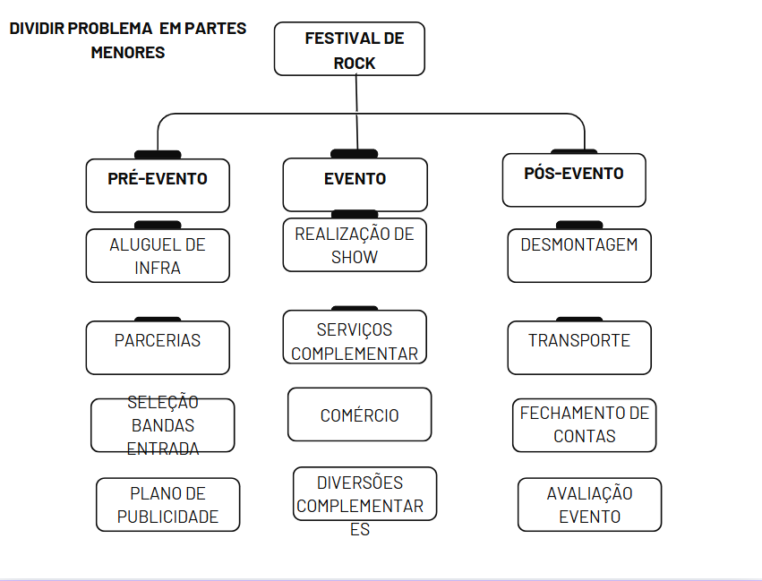
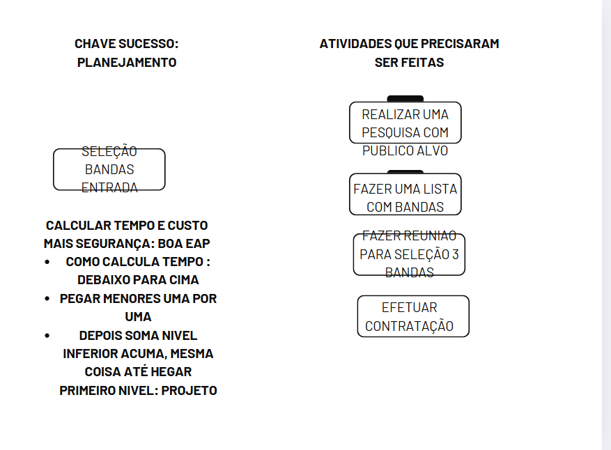

## Como planejar qualquer coisa

* Planejamento de um show de rock

 1. Quanto custaria ?
 2. Quais principais riscos envolvidos?
 3. Daqui quanto tempo o show poderá acontecer?

Respostas : obtidas no planejamento

Base : elaboração EAP ( Estrutura Analitica do projeto)

Sempre que for planejar qualquer coisa em partes menores
* Coloca nome projeto caixa superior
* Vai divindo em partes menores
* Planejar com mais segurança

